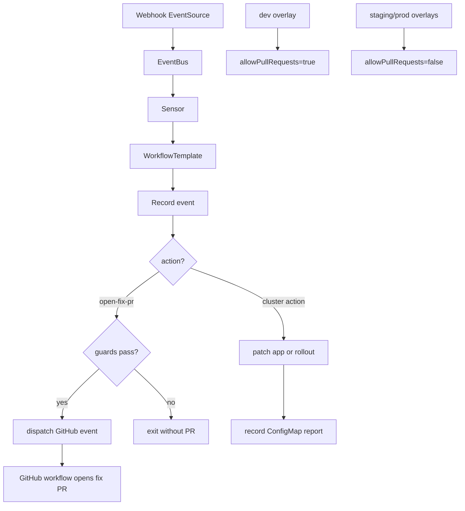

# Agent Ops Event-Driven Remediation Pipeline

This document explains how Agent Ops receives events and triggers automated remediation workflows.

## What Agent Ops does

Agent Ops is an event-driven automation layer built with Argo Events + Argo Workflows.

It can:
- Record incoming events as reports (ConfigMaps)
- Refresh an Argo CD Application
- Pause or resume an Argo Rollout
- Optionally dispatch a GitHub event to open a fix PR flow

## Main components

- Event source webhook: [base/eventsource.yaml](base/eventsource.yaml)
- Event bus (NATS): [base/eventbus.yaml](base/eventbus.yaml)
- Sensor (parameter mapping + workflow trigger): [base/sensor.yaml](base/sensor.yaml)
- Workflow logic: [base/workflow-template.yaml](base/workflow-template.yaml)
- RBAC: [base/role.yaml](base/role.yaml), [base/clusterrole.yaml](base/clusterrole.yaml)

## Logic diagram

If your markdown viewer does not render Mermaid, the flow is:

1. A webhook hits the Agent Ops EventSource.
2. The EventBus delivers it to the Sensor.
3. The Sensor starts the `agent-remediation` WorkflowTemplate.
4. The workflow always records an event report first.
5. If the action is a cluster action, it patches Argo CD applications or Argo Rollouts.
6. If the action is `open-fix-pr`, it only dispatches a GitHub event when pull requests are allowed and the required inputs are present.

## Environment behavior

- Dev overlay enables PR path by default:
  - [overlays/dev/kustomization.yaml](overlays/dev/kustomization.yaml)
- Staging and prod keep PR path disabled by default:
  - [overlays/staging/kustomization.yaml](overlays/staging/kustomization.yaml)
  - [overlays/prod/kustomization.yaml](overlays/prod/kustomization.yaml)

## Alertmanager integration examples

- Receiver config: [examples/alertmanager-receiver.yaml](examples/alertmanager-receiver.yaml)
- Sample payload: [examples/alertmanager-sample-payload.json](examples/alertmanager-sample-payload.json)
